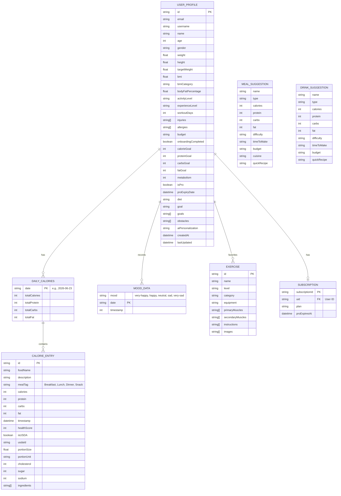

# Dietin Project - Entity Relationship Diagram (ERD)

This diagram visualizes the data models, Firestore collections, and local Zustand state structures in the **Dietin** app.

## Data Storage Overview
- **Firestore Collections**:
  - `/users/{userId}`: Stores the main `USER_PROFILE` data. Includes access control limits so users can only update their non-premium fields.
  - `/subscriptions/{subscriptionId}`: Stores user subscription details (`SUBSCRIPTION` entity). Managed completely via backend webhooks (Paymob/PayPal) or Admin SDK.
- **Local State (Zustand)**:
  - `userStore`: Stores `USER_PROFILE`, `DAILY_CALORIES`, `CALORIE_ENTRY` arrays, `MOOD_DATA` history, and local analytics counters.
  - `workoutStore`: Stores the user's favorite `EXERCISE` list.
  - `mealStore`: Stores AI-generated `MEAL_SUGGESTION` items transiently.
  - `hydrationStore`: Stores AI-generated `DRINK_SUGGESTION` items transiently.
